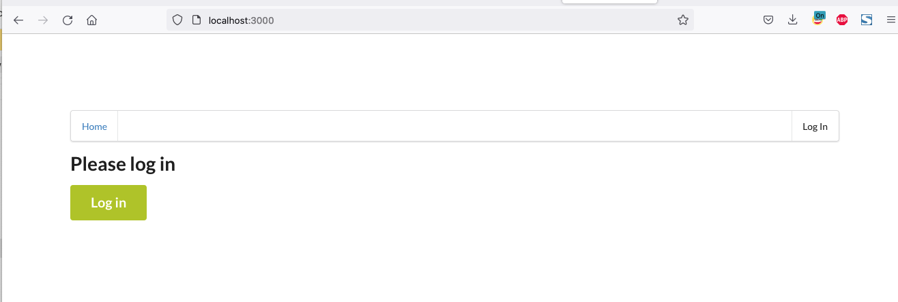
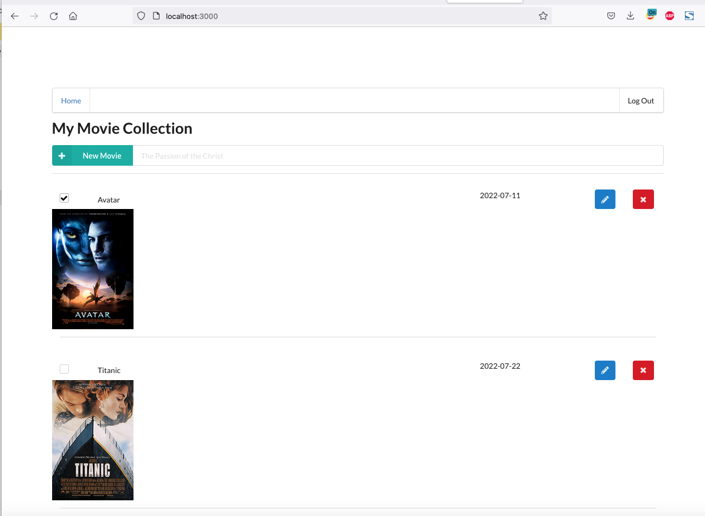
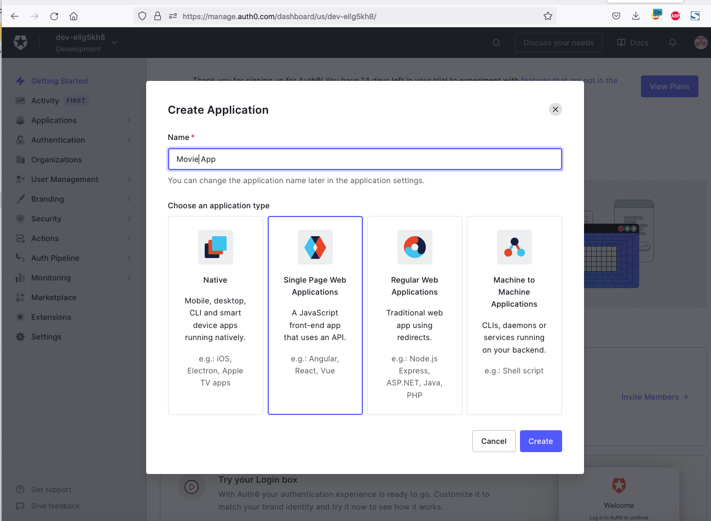

# Serverless My Movie Collection

A simple My Movie Collection application using AWS Lambda and Serverless framework, for the final project of the Udacity Cloud Developer Nanodegree. 

## Functionality of the application

1. User must log in to access the application. 

2. This application will allow creating/removing/updating/fetching Movies lists.
3. Each Movie can optionally have an attachment image. 
4. Each user only has access to Movies list that he/she has created.

 

## Prerequisites

### Node.js and NPM

Before getting started, make sure Node.js is downloaded and installed. The latest version of Node.js can be downloaded from [nodejs.org](https://nodejs.com/en/download) and it's recommended to use the LTS version.

### Serverless Framework

Serverless Framework is used to build and deploy the application. Instructions for installing Serverless Framework can be found [here](https://serverless.com/framework/docs/getting-started/).

### Amazon Web Services (AWS)

An AWS account is required to deploy the application.

### Auth0

Auth0 is used for authentication and an Auth0 application should be created with asymmetrically encrypted keys (RS256).

Set up in Auth0 as below.

1. Create Single Page Application 

2. Add `http://localhost:3000/callback` to 'Allowed Callback URLs' & 'Allowed Web Origins' fields.
3. Get the `JSON Web Key Set` value e.g 'https://xxxxxx.us.auth0.com/.well-known/jwks.json'  from `Advanced Settings -> Endpoints` and replaced in .serverless.yml 
4. Need to replace in `clientId:` at `client\config.ts` as well

## Getting started

### Backend

To build and deploy the application, first edit the `backend/serverless.yml` file to set the appropriate AWS and Auth0 parameters, then run the following commands:

1. cd to the backend folder: `cd backend`
2. Install dependencies: `npm install`
3. Build and deploy to AWS: `sls deploy`

### Frontend

To run the client application, first edit the `client/src/config.ts` file to set the appropriate AWS and Auth0 parameters, then run the following commands:

1. cd to the client folder: `cd client`
2. Install dependencies: `npm install`
3. Run the client application: `npm run start`

This should start a development server with the React application that will interact with the serverless Movie application.

### Postman collection

A Postman collection is available in the root folder of the project, as an alternative way to test the API.

## Acknowledgements

This project was bootstrapped with [https://github.com/udacity/cloud-developer/tree/master/course-04/project/c4-final-project-starter-code](https://github.com/udacity/cloud-developer/tree/master/course-04/project/c4-final-project-starter-code).
